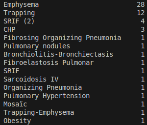
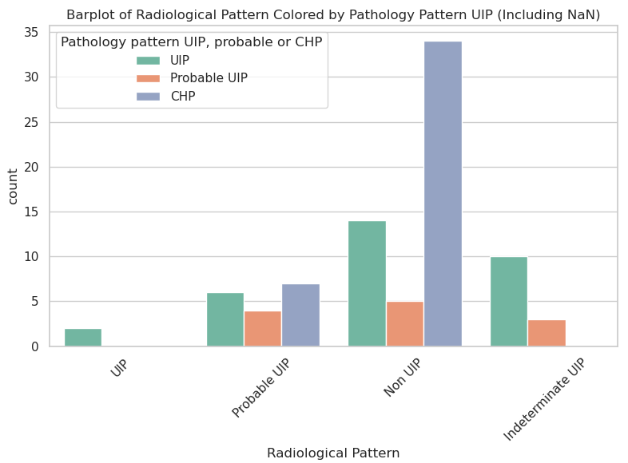
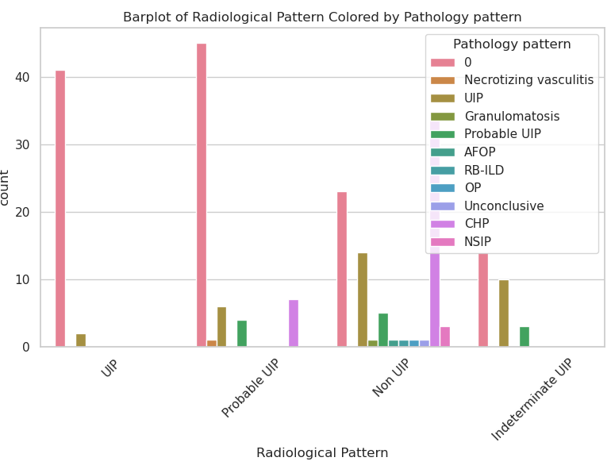
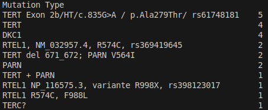

# FibroPred
bitsxmarató

## Detalles sobre Variables

- COD NUMBER: Codigo del paciente
  - Solo 5 tienen más de una entrada en el dataset
- Binary diagnosis. IPF / No IPF (IPF = Fibrosis Pulmonar Idiopática)
  - Imagino que representa si el médico le ha diagnosticado la enfermedad
  - 1 = sí tiene, else no
- Details: 
  - Super generico: 'Tobacco-associated' nan 'Organizing' 'Incipient' 'RA-SLE' 'RA' 'Anti-synthetase' 'Aviary' "Farmer's lung" 'Fungi' 'Aviary, Fungi' 'Unknown' 'Humidity'
  - Muchos NA
- Raiological Pattern: patrón radiológico observado en estudios de imágenes
  - 1 NA
  - Clases
    - UIP (Usual Interstitial Pneumonia)
    - Probable UIP (Usual Interstitial Pneumonia)
    - Non UIP
    - Indeterminate UIP
- Detail on NON UIP: Creo q solo lo tenemos en las q no tienen UIP
  - Missing values: 164
  - 
- Pathology Pattern Binary --- Unique values: [nan 'NON UIP' 'UIP']
  - YO LA QUITABA PQ ES PRACTICAMENTE RADIOLOGICAL PATTERN
  - 
- Pathology pattern UIP, probable or CHP 
    Unique values: [nan 'UIP' 'Probable UIP' 'CHP']
    - 
- Pathology pattern
    - Muchos valores únicos
    - 
- Extras AP 
  - 189 NAN
  - Muchos valores únicos
- Treatment 
  - 6 missing values 
  - En esta columna ponen muchos tratamientos, de forma que no se pueden estudiar las columnas, deberíamos convertirlas en diferentes columnas
  - EJ: "Nintedanib, pirfenidone, prednisone " codificarlo como 1 1 1 en 3 nuevas columnas de Nintedanib, pirfenidone, prednisone respectivamente
- Type of telomeric extrapulmonary affectation
  - 191 NAN
  - Casi todo único 
- Extra
  - 219 NAN
  - 3 valores y único
- Type of Neoplastia
  - 191 NAN
  - Muchos únicos
- Hematological abnormality before diagnosis
  - hacer one hot
    - convertir los YES en 1
    - convertir los NAN en 0
- Hematological disease
  - dudas en como se combina con la anterior
  - Casi todos son NO -> 0
  - Luego hay YES y algunas enfermedades especificamente explicitadas
- Liver abnormality before diagnosis
  - 21 NAN
  - ['Yes' 'No' nan]
  - Aplicar One HOT
- Liver abnormality 
  - duda con la relación de la anterior
  - ['Yes' 'No' nan]
  - Aplicar One HOT
  - 2 NAN
- Type of liver abnormality
  - 158 NAN
  - +30 clases
- Liver Disease
  - 5 NAN
  - 199 NO luego diferentes nombres distintos
- Transplantation Date
  - yo la eliminaba
  - podemos directamente convertirla en si hubo o no transplante
- Death
  - hacer ONE hot
- Cause of Death
  - yo la eliminaba
- Identified Infection
  - 216 NAN 
  - alguna gente tiene late diagnosis, sida ...
  - duda sobre q hacer
- Date of death 
  - yo la eliminaba
- Type of family history
  - 1 Missing Value
  - Muchas clases
- Mutation Type
  - 199 Missing values
  - Complicado
  - 

## Medidas a Tomar:
- Eliminamos las fechas
- Tirar causa de la muerte
- Filtrar variables que no deberíamos tener en el entreno
- Decidir variables a predecir
- Eliminar Neutropenia (columna entera de 0s, no podemos entrenar con eso)
- Eliminar Pathology Pattern Binary (contradictorio con Radiology Pattern)
- Eliminar Pathology Pattern UIP (contradictorio con Radiology Pattern)
- Eliminar Type of liver abnormality
- Combinar Radiology Pattern con Pathology Pattern
- Eliminar Detail 
- Detail on NON UIP: convertir las dos primeras clases en ONE HOT y eliminar el resto
- Eliminar Extras AP
- Modifica Treatment, ver explicación
- Eliminar otras columnas con 190+ NAN (o pensar el procedimiento)
- Type of Neoplastia, convertir en tienen o no Neoplastia
- Eliminar Identified Infection
- Eliminar Type of telomeric extrapulmonary affectation

## Las Tiramos pero igual revisamos
- Type of family history
- Liver Disease (despues de hablar con ella)
- Mutation Type

## Preguntas
- Que hacer con liver y hemanoseque antes y despues del diagnostico
- Que hacer con las variables sobre Radiologia y Patologia
- Liver disease vs Liver abnormality
- Treatment
- Pedigree
- Multidisciplinary Comitee